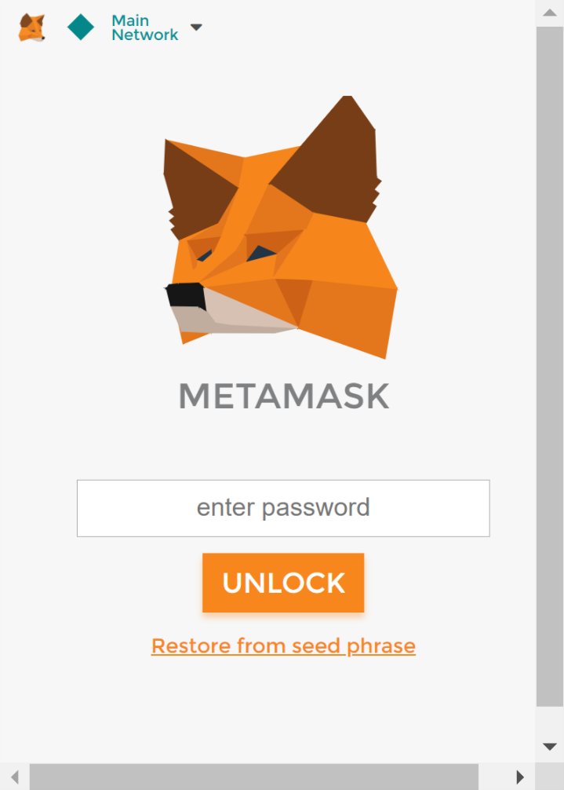
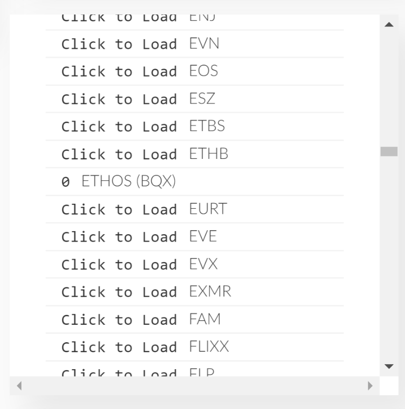
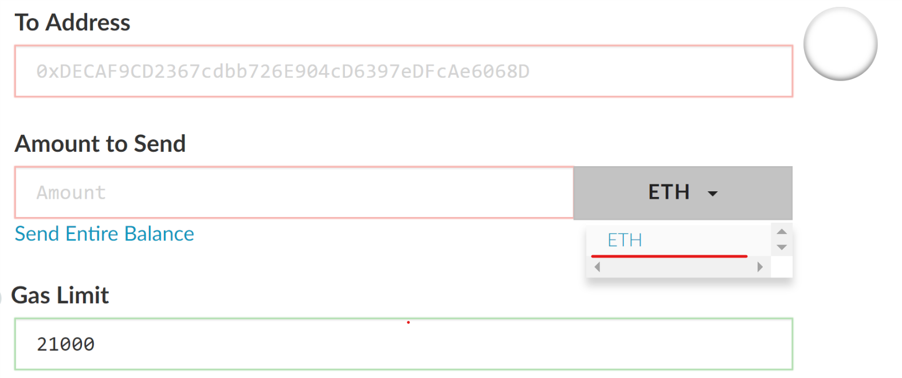

From Mt. Gox, to more recently Bitgrail - history keeps showing us that cryptocurrency exchanges are not a suitable place to keep your coins. The burning question that crosses the minds of the people new to Ethereum (or cryptocurrency in general) is where to store their precious Ether and other ERC-20 tokens? The two most popular solutions at the moment are [Metamask](https://metamask.io/) and [MyEtherWallet](myetherwallet.com). Whilst neither of them are easy enough for your grandma to use (yet), both of these applications are free, have a large community backing and are widely used Ethereum wallets. So which one to use?

## MetaMask

Metamask is a browser extension that allows you to create an Ethereum wallet. It actually goes beyond a simple cryptocurrency wallet as it allows you to run decentralised applications (dApps) straight from your browser.

Metamask allows you to create a 'vault' which is an encrypted file stored on your computer. A vault can have multiple wallets (accounts) associated with it. When you create a new vault you're given a 15 word combination called _seed_, which you can use to restore your vault with all the associated wallets. This is quite handy, since you only have to secure one seed, however it also adds a risk of losing access to all of your wallets if you don't have their private keys backed.

### Ease of use

Creating a new vault and account takes about 10 seconds. The application has a cheerful design, clear navigation and generally is quite intuitive to use.

*Metamask user interface*

However, sending ERC-20 tokens requires manually adding the contract address, which could be daunting to someone completely new to cryptocurrency. Whether, it's a security precaution or a missing feature I hope to see a more automated way to send tokens in the future.

### Quirkiness

Recovering __all__ of your Ethereum wallets from a Metamask seed can be somewhat confusing. Just have a look at all the stress someone had to go through in this [thread](https://github.com/MetaMask/metamask-extension/issues/2641). However, Metamask has a built-in feature which allows to export the private keys to your wallets, which I definitely recommend for the peace of mind.

Also, when making transactions I found that the automatically pre-set _gas price_ and _gas limit_ is usually lower that the network's average. Therefore, always check [ETH Gas Station](https://ethgasstation.info/) to avoid your transactions being stuck, especially when you wish your transactions to be executed fast (e.g. during ICO's).

## MyEtherWallet

MyEtherWallet (MEW) is a website where you can create an Ethereum wallet and send tokens. Since it's a website it's been a frequent target for phishing attacks, however the website does a good job at communicating potential risks and even gives a small tutorial on blockchain.

The major advantage MEW has over Metamask is that it can be accessed through your smartphone if you're on the move and really need to access your wallet.

### Ease of use

Creating a new wallet with MEW also takes under 10 seconds. Once you create a wallet you'll be given your _private key_ and a _keystore_ file. You can use either of them to open your wallet. However, the safest method is to actually use Metamask itself. Personally I recommend using this approac as it'll be much faster and safer than copy-pasting your private key every time you want to unlock your wallet.

One particular thing that I like about MEW is that it provides a list of tokens that you can 'import', therefore it doesn't require you to add a custom token like in Metamask (unless it's a brand new token that's not yet registered).

*List of available tokens*

*Once you load a token it'll appear here as a choice*

### Quirkiness

MEW is no saint when it comes to quirks. For instance, when sending tokens often times the recipients address is blank (the data in the transaction is still correct). This can cause a lot of confusion and stress especially when large sums of money are involved.

Also, at times the application randomly spits out incomprehensive errors, which I learned to ignore, but again someone who's just starting could be quite confused.

## Summary

Now some of you may ask _"what's the point of using MEW, when you can send Ethereum and tokens via Metamask?"_. Well it's a personal preference, but in general I recommend using both. I found that with MEW it's a bit easier to send tokens, because you can select from a list of predefined tokens, whereas in Metamask you have to add every token you wish to send. Since I send lots of different tokens I prefer to just select from a list.

At the same time Metamask's vault and seed mechanism allows for safer and easier wallet management and backup. It also integrates well with MEW and is even specified as the _recommended_ way of access.

Whilst neither of the solutions are ideal, they're free and complement each other well. Bearing in mind that it's still early stage in cryptocurrency adoption I look forward to see these two applications improve.
