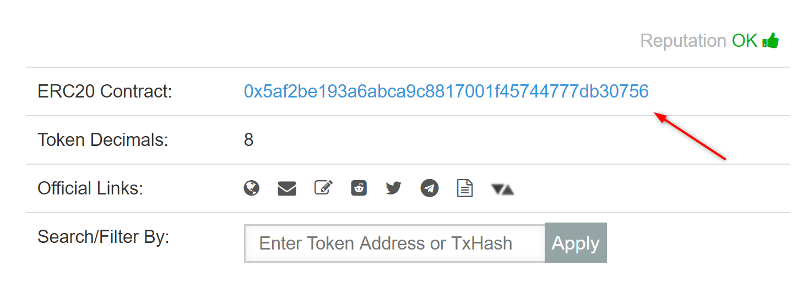

Getting started with Ethereum transactions can be a cumbersome task. Terms like _gas price_ and _gas limit_ can be confusing to grasp for someone who's just starting to use blockchain. On top of that, the current wallets are not 100% user-friendly yet, which can lead to people making mistakes and resulting in their transactions being stuck in a limbo to being completely lost. Therefore, in this article I've gathered some insights and personal tips that I use myself, which will hopefully be useful for those who've just started or have been using Ethereum for a while.

All of you may have different questions right now: 
- _"I have a token on an exchange how do I store it in my wallet?"_
- _"I want to participate in an ICO, how do I do that?"_
- _"Can I send Ethereum from my smartphone?"_

In this article we will answer all of these questions and more.

### Storing Ether and ERC-20 tokens

There are a number of free Ethereum wallets that you can choose to store and send your Ether and tokens the two of the most popular being MetaMask and MyEtherWallet.

> You can find my comparison between them [here](/metamask-vs-myetherwallet-which-to-choose).

### I want to send ERC-20 tokens but the receiving address is different than the one I input?

To understand this you first need to understand what happens when you send a token. ERC-20 compatible tokens use _token contracts_, which essentially are one to one mappings of address -> balance. This allows different exchanges (and wallets) to show balances of ERC-20 compatible tokens by simply providing the token's contract address. Therefore, when you send a token through, say MyEtherWallet, what actually happens is that your and the recipient's addresses are put into the metadata of the transaction, however the tokens themselves are sent to the token contract address which updates the balances for both you and the recipient.

Therefore, if you're sending a token and see a different recipient address it's most likely the token contract address. However, you can always check that's true by going to [Etherscan](https://etherscan.io/), finding the token you wish to send and comparing it's ERC20 contract address to the one you get.

*This is where token contract address is shown*

### Why can't I use my exchange deposit address for an ICO?

Generally during an ICO, the project issuing tokens will use a smart contract to do so. When the tokens are issued they are usually sent back to the address that made the payment. The problem is that the Ethereum wallet you get to use on your exchange is not actually yours. Think of it as booking a room on Airbnb: you get to sleep there but none of it belongs to you. And that's essentially what happens when you send Ether for an ICO from your exchange. The exchange might get the tokens but they might:

* Not be willing to give it back.
* Not even support the token you're buying at all.

Therefore, the rule of thumb is to __not__ use exchanges for ICOS.

