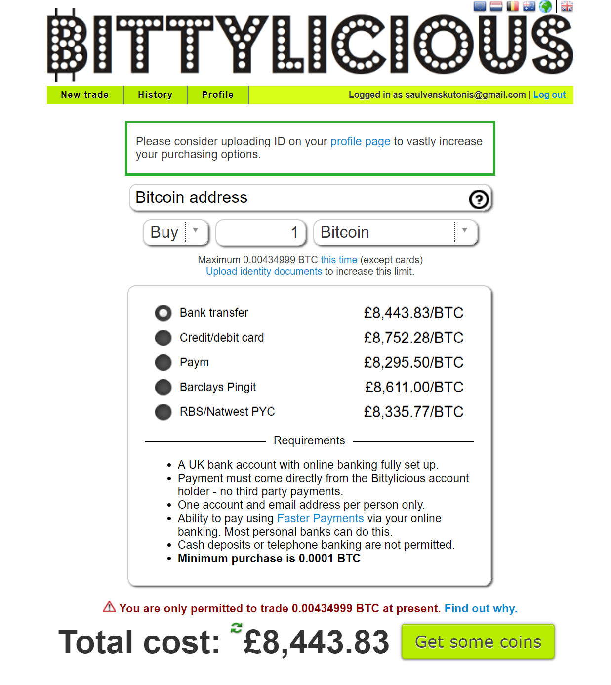

It's rather cheap to get Bitcoin or Ether when you buy it with dollars or euros as Coinbase, Bitfinex, Kraken and many other exchanges offer fiat to crypto conversion in these currencies. But what to do if you have GBP?

### LocalBitcoins and Bittylicious are expensive

The first result you get when you google 'buy Bitcoin in UK', will most likely be one these services that I call 'Gummtree (or Craigslist for you US folks) for crypto'. Generally, they connect people who want to sell crypto with those who want to buy, however you're tied to a very specific payment method and quantity.

This may sound like a good idea - you buy directly from a person with no intermediaries, right? Except it's _really_ expensive to buy that way. At the moment of writing this article the price of Bitcoin is $11,166.90, which roughly translates to around £8087.85. If you would to buy through Bittylicious you'd spend a whooping £8,443.83.

*This is how much you'd have to spend on Bittylicious*

This may sound counter productive as you'd expect to pay less by not having to convert euros or dollars and dealing with the person directly. However, the reality is the exact opposite.

### Cutting costs with SEPA payments

In practice it's actually cheaper to buy crypto from an exchange by depositing from your UK based bank. All popular banks such as HSBC, Lloyds, TSB, Barclays, etc. offer Single Euro Payments Area (SEPA) payments. This means that sending money to one of the SEPA-enabled euro bank accounts shouldn’t cost any more than a regular, local transfer plus the fee for GBP to EUR exchange. Most exchanges such as Kraken and Coinbase have a bank account with a SEPA-enabled European bank therefore you can send the money straight in GBP. The interesting thing is that even with an exchange fee as large as 3%, you'd still end up paying less than buying through Bittylicious in this case (£8330 vs £8,443).

### Using Trasfergo or Transferwise

A better approach is to __not__ convert the pounds at all. Services such as [Transfergo](transfergo.com) and [Transferwise](transferwise.com) have gained lots of media attention recently for their innovative approach to sending money abroad. Basically, they operate bank accounts in multiple countries and currencies. For example let's say that you want to send money to someone in Germany from the UK. Instead of transferring money to a German bank and incurring large exchange fees you would transfer it to one of Transfergo/Transferwise accounts in the UK. They would register the transfer and in return send the equivalent amount to your recipient from their German bank account. Whilst the exchange rate they give is not 100% fee-less, transferring this can be as much as 10x cheap. Therefore, if you have a euro bank account in another country you could simply send your pounds to it with little fees.

#### What if you don't have a euro bank account

In that case the choices are bit more limited. For example Transferwise blocks transfers to cryptocurrency exchanges, however you still might be able to deposit your GBP's to a cryptocurrency exchange through Transfergo.

### Summary

In general, I tend to avoid LocalBitcoins and other similar services due to how much they charge. I believe that it can be easier (and cheaper) to simply transfer do a SEPA transfer from use a UK bank which offers the lowest exchange fees (Lloyds and Halifax are among the cheapest ones). If you're lucky and have a euro bank account I recommend using Transfergo or Transferwise (you can compare both to see which gives you a better rate).
